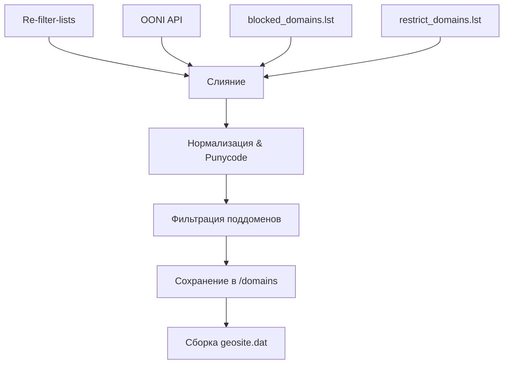

# 🚫 Domain List: Блокировки и ограничения доступа в РФ

Этот репозиторий содержит списки доменов, недоступных в РФ. Он основан на работе проекта [Re-filter-lists](https://github.com/1andrevich/Re-filter-lists/tree/main) и дополнен собственнымм списками доменов, которые либо не попали в другие списки, либо были заблокированы для доступа из РФ, но не внесены в реестр РКН, а также данными системы мониторинга цензуры **OONI**.

✅ **Обновляется автоматически раз в неделю** через GitHub Actions.

## 📚 Источники данных

1. **Re-filter-lists**: Основной список доменов берется из репозитория [Re-filter-lists](https://github.com/1andrevich/Re-filter-lists/tree/main). Подробнее в статье на Хабре: [Создаем свой список блокировок сайтов (DNS)](https://habr.com/ru/articles/850292/).
2. **OONI (Open Observatory of Network Interference)**: Автоматическое получение подтвержденных блокировок в РФ за последние 7 дней через API OONI.
3. **Локальные списки (`src/`)**:

- **`src/blocked_domains.lst`**: Этот список формируется (пока еще думаю как) вручную на основе личных наблюдений, сообщений других пользователей и других источников. Он содержит домены, которые заблокированы РКН. 
Источники:  
https://docs.usergate.com/spiski-url_143.html  
https://antifilter.download/  
https://antifilter.network/  
https://community.antifilter.download/  
https://reestr.rublacklist.net/ru/?status=1&gov=all&date_start=&date_end=  

- **`src/restrict_domains.lst`**: Этот список включает домены, владельцы которых ограничили доступ с российских IP-адресов «геоблоком». Эти домены не заблокированы РКН(не все, есть уже которые и блочит РКН).
Источники:  
https://github.com/123jjck/russia-proxy-hosts/blob/main/hosts.txt  
https://github.com/itdoginfo/allow-domains/blob/main/Categories/geoblock.lst  
https://github.com/dartraiden/no-russia-hosts/blob/master/hosts.txt  
https://github.com/censortracker/ctconf/blob/main/reverse-restrictions/ru/sites.json  

x-ray  
https://github.com/unidcml/domain-list-community  
https://github.com/v2fly/domain-list-community  
https://github.com/Nidelon/ru-block-v2ray-rules  

## 📥 Скачать

Актуальные файлы всегда доступны в ветке `release` (прямые ссылки) или в разделе **Releases**.


- **`all_domains.lst`**
Весь список доменов (текст)

  🔗 https://github.com/mi1su/domain_list/releases/latest/download/all_domains.lst  
  ⚙️ https://raw.githubusercontent.com/mi1su/domain_list/release/all_domains

- **`dnsmasq_domains.lst`**
Формат nftset для dnsmasq

  🔗 https://github.com/mi1su/domain_list/releases/latest/download/dnsmasq_domains.lst  
  ⚙️ https://raw.githubusercontent.com/mi1su/domain_list/release/dnsmasq_domains.lst

- **`geosite.dat`**
Бинарный файл для Xray/V2Ray

  🔗 https://github.com/mi1su/domain_list/releases/latest/download/geosite.dat   
  ⚙️ https://raw.githubusercontent.com/mi1su/domain_list/release/geosite.dat


## ⚙️ Скрипты

### `domains.py`

Скрипт используется для автоматического обновления и объединения списков доменов. Он запускается автоматически посредством GitHub Actions (конфигурация в `.github/workflows/create-lists.yml`).

**Алгоритм работы скрипта:**

1.  **Загрузка (download_domains):** Загружает актуальный список доменов из репозитория Re-filter-lists по указанному URL. Функция `download_domains(url)` реализует эту операцию, возвращая список доменов. В случае ошибки скачивания, скрипт завершает работу.
2. **Чтение локального списка (read_local_domains):** Читает список доменов из локального файла. Функция `read_local_domains(file_path)` возвращает список доменов, прочитанных из файла. В случае отсутствия файла или ошибки чтения, скрипт завершает работу.
3. **Фильтрация поддоменов (filter_subdomains):** Фильтрует поддомены верхнего уровня (TLD) и оставляет только один из группы похожих доменов. Функция `filter_subdomains(domains)` принимает список доменов и возвращает отфильтрованный список.

4. **Очистка доменов (clear_domain):** Обрабатывает "зеркала" доменов, оставляя только один из похожих. Функция `clear_domain(domains)` принимает список доменов и возвращает уникальные домены.

5. **Объединение списков (merge_lists):** Объединяет удаленный и локальные списки доменов и фильтрует дубликаты. Функция `merge_lists(remote_domains, local_domains)` принимает несколько списков доменов и возвращает объединенный и отфильтрованный список.

6. **Сохранение объединенного списка (save_merged_list):** Сохраняет объединенный список доменов в файл. Функция `save_merged_list(merged_domains, output_file)` принимает список доменов и путь к выходному файлу.

7. **Генерация dnsmasq-nfset в формате nftset (save_nftset_list):** Сохраняет список доменов в формате nftset для использования в конфигурации `nftables`. Функция `save_nftset_list(merged_domains, nfset_file)` принимает список доменов и путь к выходному файлу. Каждая строка в выходном файле имеет формат `nftset=/{domain}/4#inet#fw4#vpn_domains\n`, что соответствует правилу nftset для IPv4.

8. **Основная функция (main):** Координирует выполнение всех шагов, загружая, читая, фильтруя, объединяя и сохраняя списки доменов. В случае ошибки на любом этапе, скрипт выводит сообщение об ошибке и продолжает выполнение.

Логика работы скрипта domain.py

### Алгоритм фильтрации доменов
1. **Нормализация**  
   Все домены приводятся к нижнему регистру и очищаются от `www.`:
   ```python
   "WWW.Google.com" → "google.com"
   ```

2. **Фильтрация TLD**  
   Удаляются домены верхнего уровня (`.com`, `.net`):
   ```python
   ".ru" → удаляется
   ```

3. **Обработка поддоменов**  
   Для каждого домена 3-4 уровня сохраняется только родительский домен:
   ```python
   "mail.google.com" → "google.com"
   ```

4. **Группировка зеркал**  
   Для доменов с одинаковым базовым именем сохраняется первый вариант:
   ```python
   ["google.ru", "google.com"] → "google.com"
   ```

5. **Слияние списков**  
   Объединение данных из 3 источников с дедубликацией:
   ```python
   remote_domains (Re-filter-lists) + 
   blocked_domains (РКН) + 
   restrict_domains (геоблок) → 
   merged_domains
   ```

### Визуализация процесса


### `domain_cleaner.py`

Этот скрипт предназначен для очистки и подготовки личного списка доменов (`src/domains.lst`). Он позволяет:

*   Удалять дубликаты.
*   Удалять домены `.ua`.
*   Удалять записи `www.`.
*   Группировать зеркала и оставлять только основной домен.

Этот скрипт используется локально для ручной обработки личного списка доменов. Подробное описание его функциональности необходимо добавить отдельно в README.md после его написания(когда нибудь).

## 🛠 Использование
### OpenWrt (dnsmasq + nftables)

Файл `dnsmasq_domains.lst` предназначен для использования в OpenWrt, содержит правила для блокировки доменов с помощью `dnsmasq` и `nftset`. 
Инструкция по настройке OpenWrt с использованием этих файлов будет добавлена позже. На данный момент реализована поддержка IPv4, но предусмотрена возможность добавления IPv6 (соответствующая строка закомментирована в скрипте `domains.py`).

```sh
# Пример правила в dnsmasq.conf
nftset=/youtube.com/4#inet#fw4#vpn_domains
```

Добавьте путь к файлу в `dnsmasq.conf` через `conf-file=`.

### Для XRay/V2Ray (geosite.dat)
**Пример конфигурации для xray**:
```json
{
  "routing": {
    "domainStrategy": "IPIfNonMatch",
    "rules": [
      {
        "type": "field",
        "domain": ["ext:geosite.dat:domains-list"],
        "outboundTag": "proxy"
      }
    ]
  }
}
```

как настраивать xray и как использовать тоже будет позже когда нибудь :) 

**geosite.dat**:
## 🔍 Просмотр содержимого geosite.dat

### Метод 1: Поиск текстовых строк
```bash
strings geosite.dat
```
Эта команда выведет все текстовые строки, которые можно интерпретировать как обычный текст, из файла geosite.dat. для поиска читаемых данных в бинарных файлах.

```bash
strings geosite.dat | grep -i "example.com"
```
```sh
strings geosite.dat | head -n 20
```
посмотрим первые 20 строчек

**Пример вывода:**

```text
DOMAINS-LIST
facebook.com
twitter.com
youtube.com
```

### Метод 2: Шестнадцатеричный просмотр
```sh
xxd geosite.dat
```
Вы получите вывод с двумя колонками: в одной будет адрес, а в другой — данные в шестнадцатеричном виде и ASCII-эквиваленты.
```bash
xxd geosite.dat | head -n 20
```

**Результат:**
```
00000000: 6765 6f73 6974 652e 6461 7400 0000 0000  geosite.dat.....
00000010: 0100 0000 0000 0000 0000 0000 0000 0000  ................
```

---

> 💡 **Примечание**: Инструкции по настройке будут дополняться.  
> Для предложений и исправлений создавайте Issues или Pull Requests.

## ⭐ Поддержка проекта

Вы можете поддержать проект, поставив :star: этому репозиторию (сверху справа этой страницы)

<a href="https://star-history.com/#mi1su/domain_list&Date">
 <picture>
   <source media="(prefers-color-scheme: dark)" srcset="https://api.star-history.com/svg?repos=mi1su/domain_list&type=Date&theme=dark" />
   <source media="(prefers-color-scheme: light)" srcset="https://api.star-history.com/svg?repos=mi1su/domain_list&type=Date" />
   
 </picture>
</a>
